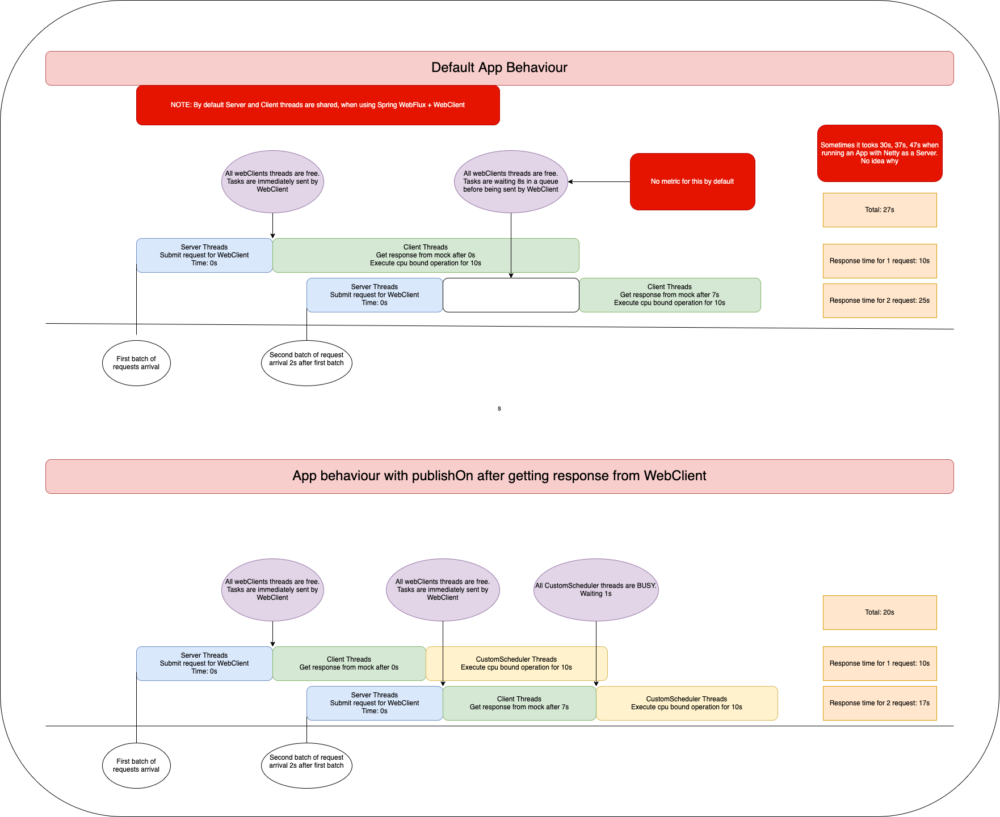

# Most important thing here
```kotlin
private fun dummy(index: String): Mono<SomeResponse> {
    // runs on server thread
    webClient
        .get()
        .uri("http://localhost:8083/dummy/1")
        .retrieve()
        .bodyToMono(SomeResponse::class.java)
        .map {
            // runs on client thread, for WebFlux thread pool is shared
            someProcessing()
        }
        // In order to switch processing to another thread 
        // If log line: `End WEB_CLIENT_PENDING_REQUEST_TIME. Took: X seconds` shows values greater than 0
        // .publishOn(customParallelScheduler) <--------- THIS LINE
```

# Architecture

## Using Netty as Server and Client
```text
request-sender 
    -> webflux-defaults-app       
        -> mock-external-service
```

## Using Undertow as Server and Netty as Client
```text
request-sender 
    -> webflux-undertow-server-client-netty 
        -> mock-external-service
```
    
# How to use - Netty flow
1. Run `RequestSenderApp`
2. Run `WebfluxDefaultsApp`
3. Run `MockExternalServiceApp`
4. Warmup webClients
```shell
curl http://localhost:8080/warmup
```
5. Run one of those:
- option 1 - default app behaviour
```shell
curl http://localhost:8080/send-requests-default/netty
```
- option 1 - webflux-defaults-app will use `publishOn` after getting response from WebClient
```shell
http://localhost:8080/send-requests-with-publish-on/netty
```

# How to use - Undertow flow
1. Run `RequestSenderApp`
2. Run `UndertowServerApp`
3. Run `MockExternalServiceApp`
4. Warmup webClients
```shell
curl http://localhost:8080/warmup
```
5. Run one of those:
- option 1 - default app behaviour
```shell
curl http://localhost:8080/send-requests-default/undertow
```
- option 1 - webflux-defaults-app will use `publishOn` after getting response from WebClient
```shell
curl http://localhost:8080/send-requests-with-publish-on/undertow
```

# How does it work




# Results

## Netty Server & Client
```shell
curl http://localhost:8080/send-requests-default/netty
```

WEB_CLIENT_PENDING_REQUEST_TIME. Took: For first batch 0s ✅

WEB_CLIENT_PENDING_REQUEST_TIME. Took: For second batch 8s ❌ No metric for `Event loop task duration tracking`

```shell
curl http://localhost:8080/send-requests-with-publish-on/netty
```
WEB_CLIENT_PENDING_REQUEST_TIME. Took: For first batch 0s ✅

WEB_CLIENT_PENDING_REQUEST_TIME. Took: For second batch 8s ✅

## Undertow Server, Netty Client
```shell
curl http://localhost:8080/send-requests-default/undertow
```
WEB_CLIENT_PENDING_REQUEST_TIME. Took: For first batch 0s ✅

WEB_CLIENT_PENDING_REQUEST_TIME. Took: For second batch 8s ✅

```shell
curl http://localhost:8080/send-requests-with-publish-on/undertow
```
WEB_CLIENT_PENDING_REQUEST_TIME. Took: For first batch 0s ✅

WEB_CLIENT_PENDING_REQUEST_TIME. Took: For second batch 0s ✅
